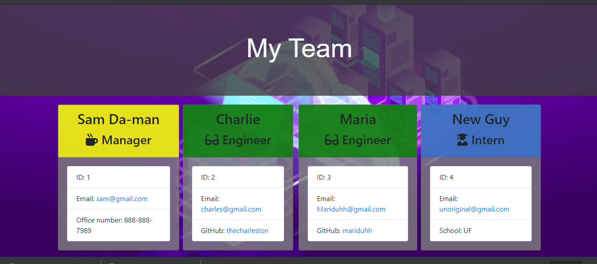

  # Project Name 

  Team Profile Generator

  ## Overview 
  A node program that promtps the user to add members to their team and give basic info for each member. The generator then builds team member cards and outputs those cards into an html file that contains your new team profile! 

  ## Table of Contents:
  - [Links](#Links)
  - [Screenshots_and_GIFs](#Screenshots_and_GIFs)
  - [Usage](#Usage)
  - [Installation](#Installation)
  - [How_to_use](#How_to_use)
  - [License](#License)
  - [Tests](#Tests)
  - [Contribute](#Contribute)

 ## Links
  - (https://camerong88.github.io/Team-Profile-Generator/)
  - (https://github.com/CameronG88/Team-Profile-Generator)

 ## Screenshots_and_GIFs 
  - 
  - 
  - 
  
  ## Usage
  This project is to organize personal info and to access contact info quickly.  It is best used when new members are added to a team so all the info can be quickly accessed when needed. 

  ## Installation  
  The only required install to setup is npm inquirer package. Use the code 'npm i inquirer' to get inquirer or 'npm i' to get all dependencies for this application.

  ## How_to_use
  After you make sure you have all the dependencies, run the code 'node app.js' in terminal to generate the team member prompts. Answer all the questions until you have completed inputting your team, then select "No more employees in team". This will then generate your new team profile in an html file called "team.html" in the output folder. Just use your favorite browser to display the html and visualize your team!  

  ## License 
  MIT

  ## Credits
  John Dinsmore, Jorge Alvarez

  ## Tests
 This project passed all 4 tests prior to building application.

  ## Contribute
  You can contribute by committing or commentting to the project in github using the link above.

  © Copyright 2020